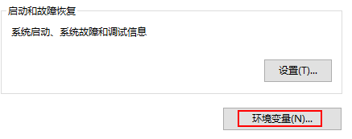
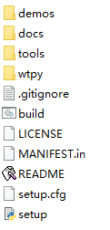
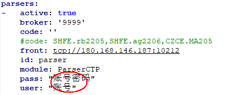
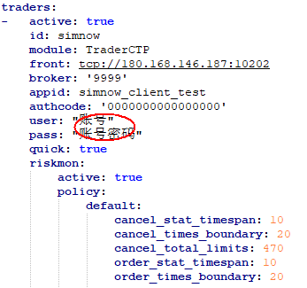

# WonderTrader 简明手册

​                                     																			***版本 Ver 0.91***

## **功能简介：**

- WonderTrade 开发框架基于C++语言开发，支持*windows*和*linux*双平台系统
- 支持国内股票、期货等全品种交易市场
- 策略应用层提供基于C++的**wtcpp**和*Python*的**wtpy**的应用框架
- 提供四种交易引擎，以适应高频与跨周期多因子交易策略
- 多账户多产品配置管理
- 图形化监控分析控制台
- 风险控制机制
- 高速tick级别回测模块			

## 配置安装：

### 一、wtpy应用框架

**1、安装 Python（版本3.6以上，32位或64位，windows7或windows10操作系统）**

1. 下载地址：https://www.python.org/downloads/

2. 配置path环境变量：

   ​	配置教程：https://jingyan.baidu.com/article/b7001fe1dd1ccc0e7282dd36.html

   

3. 安装完成后，检查下python是否安装成功。检查方法如下：

   ```
   1、打开cmd，输入python，点击回车。
   2、输入import this，欣赏下python之禅。
   3、输入exit()，退出python。
   4、输入pip list，检查安装了哪些第三方的安装包。
   ```

4. 配置pip国内源

   ```
   c:>\pip config set global.index-url https://pypi.tuna.tsinghua.edu.cn/simple
   ```

5. 安装wtpy支持包

   ```
   c:>\pip install wtpy --upgrade
   c:>\pip install itsdangerous==2.0.1
   ```

6. 安装完成以后，输入以下命令，可以查看wtpy的版本号

   ```
   C:>\pip show wtpy
   ```

**2、下载WonderTrader量化开发框架**

1. 下载wtpy应用框架：

   ​        github地址：https://github.com/wondertrader/wtpy
   ​           gitee地址：https://gitee.com/wondertrader/wtpy

2. 解压安装目录

   ```
   d:>\wonertrader\wtpy
   ```

   	

**3、启动wtpy数据行情应用（上期期货仿真交易环境 ）**

1. 注册仿真账号

   **simnow**注册网址：*http://www.simnow.com.cn*

   ​	*第一次使用仿真账号需更改一次账号密码*

2. 配置数据行情机

   用文本编辑工具打开：***d:>\wonertrader\wtpy\demos\\datakit_fut\mdparsers.YAML***

   添加账号信息保存后退出（行情前置不检测账号信息，用期货行情前置地址保证数据稳定）

   

3. 启动行情机

   执行文件所在目录：***demos\\datakit_fut***

   启动执行： **runDT**

**4、启动wtpy策略交易应用**

1. 配置**CTA**引擎策略交易

   用文本编辑工具打开：***d:>\wonertrader\wtpy\demos\\cta_fut\tdtraders.YAML***

   添加账号信息保存后退出（交易地址是仿真前置地址，登录时需要验证账号信息）

   

2. 启动策略应用

   执行文件所在目录：***demos\\cta_fut***

   启动执行：**run**

   

### 二、wtcpp应用框架


## tick回测模块使用：

## CTA引擎策略实现示例：

#### wtpy应用框架

#### wtcpp应用框架

