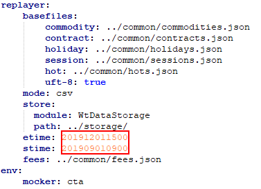
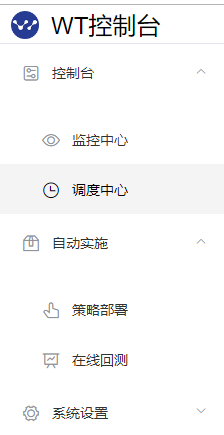
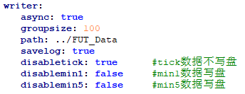

# WonderTrader 简明使用手册

***版本 Ver 0.9.1***


**关于WonderTrader开源量化交易框架：**

Wesley 开发者（知乎频道）

https://www.zhihu.com/people/yanguoye/posts																					

WonderTrader（官方github）

https://github.com/wondertrader

------

## 功能简介：

- `WonderTrade` 开源开发框架基于`C++`语言开发，支持`windows`和`linux`双平台系统

- 支持国内股票、期货等全品种交易市场

- 策略应用层提供基于`C++`语言的**wtcpp**和`Python`语言的**wtpy**的两套应用框架

- 提供四种交易引擎，以适应高频与跨周期多因子交易策略场景

- 多账户、多产品团队配置管理方案

- 图形化策略监控分析控制台

- 风险控制机制

- 高速`cvs`与`tick`级别回测模块		

  

# 配置安装：

**WonderTrade 适用操作系统：**

```yaml
windows7
windows10
centos7
Ubuntu 18.04.3 LTS
```

### 一、wtpy应用框架

**【1】安装 Python（版本3.6以上，32位或64位）**

1. 下载地址：https://www.python.org/downloads/

2. 配置path环境变量

   ​	配置教程：https://jingyan.baidu.com/article/b7001fe1dd1ccc0e7282dd36.html

   

3. 安装完成后检查python是否安装成功

   检查方法如下：

   ```css
   1、打开cmd，输入python，点击回车
   2、输入import this，欣赏下python之禅
   3、输入pip list，检查安装了哪些第三方的安装包
   4、输入exit()，退出python
   ```

4. 配置pip国内镜像源

   ```css
   c:>\pip config set global.index-url https://pypi.tuna.tsinghua.edu.cn/simple
   ```

   其它镜像源：

   ​	https://mirrors.aliyun.com/pypi/simple/ 

5. 安装wtpy支持包

   ```css
   c:>\pip install wtpy --upgrade
   c:>\pip install itsdangerous==2.0.1
   ```

6. 以下命令查看wtpy的版本号

   ```css
   C:>\pip show wtpy
   ```

**【2】下载WonderTrader量化开发框架**

1. 下载wtpy应用框架

   ​        github地址：https://github.com/wondertrader/wtpy

   ​           gitee地址：https://gitee.com/wondertrader/wtpy

2. 解压安装目录

   ```css
   d:>\wondertrader\wtpy
   ```

   	

**【3】启动wtpy数据行情应用（上期期货仿真交易环境 ）**

1. 注册仿真账号

   **simnow**注册网址：*http://www.simnow.com.cn*

   ​	*第一次使用仿真账号需更改一次账号密码*

2. YAML配置文档教程

   **YAML**语法规则：*https://www.runoob.com/w3cnote/yaml-intro.html*

2. 配置数据行情机

   用文本编辑工具打开：***d:>\wondertrader\wtpy\demos\\datakit_fut\mdparsers.YAML***

   添加账号信息保存后退出（行情前置不检测账号信息，改用期货公司行情前置地址保证数据稳定）

   

3. 启动行情机

   执行文件所在目录：***demos\\datakit_fut***

   启动执行： **runDT**

**【4】启动wtpy策略交易应用**

1. 配置**CTA**引擎策略交易

   用文本编辑工具打开：***d:>\wondertrader\wtpy\demos\\cta_fut\tdtraders.YAML***

   添加账号信息保存后退出（交易地址是仿真前置地址，登录时需要验证账号信息）

   

2. 启动策略应用

   拷贝wtpy目录到cta_fut目录；

   执行文件所在目录：***demos\\cta_fut***

   启动执行：**run**
   

### 二、wtcpp应用框架

1. 下载wtcpp应用框架

   ​        github地址：https://github.com/wondertrader/wondertrader

   ​        gitee地址：https://gitee.com/wondertrader/wondertrader

2. 解压安装目录

   ```css
   d:>\wondertrader\wtcpp
   ```

   

3. 配置数据行情机

   用文本编辑工具打开配置文件：***d:>\wondertrader\wtcpp\dist\QuoteFactory\mdparsers.YAML***

   添加账号信息保存后退出（行情前置不检测账号信息，改用期货公司行情前置地址保证数据稳定）

   

4. 启动行情机

   执行文件所在目录：***dist\\QuoteFactory***

   启动执行： **QuoteFactory**

5. 配置CTA引擎策略交易

   用文本编辑工具打开：***d:>\wondertrader\wtcpp\dist\\WtRunnerCta\\tdtraders.YAML***

   添加账号信息保存后退出（交易地址是仿真前置地址，登录时需要验证账号信息）

   

6. 启动策略应用

   执行文件所在目录：***dist\\WtRunnerCta***

   启动执行：**WtRunner**


## *使用注意事项：*

```
1、行情机执行启动时间早于开盘时间2分钟
2、行情机关闭时间晚于16：30分钟
3、启动行情机后再启动CTA引擎策略交易应用
4、编辑YAML文件语法规则
5、自定义订阅品种注意品种名称格式
```


# 交易回测：

1. wtpy应用框架

   实盘时添加多个策略，但回测时仅允许同时回测一个策略。

   **（i）回测配置**

   用文本编辑工具打开：***d:>\wondertrader\wtcpp\demos\cta_fut_bt\\configbt.YAML***

   - *修改回测时间范围*
   - *修改数据路径*
   - *修改回测使用**csv**或者**tick**模式*
   - ***cta**引擎*

   

   **（ii）启动回测**

   执行所在目录：**demos\cta_fut_bt**

   启动执行前修改：**runBT.py**

   - *测试时间范围*
   - *策略参数*
   - *数据路径*
   - *回测模式 csv / tick*

   启动执行回测：**runBT**

   ```python
   from wtpy import WtBtEngine,EngineType
   from wtpy.apps import WtBtAnalyst
   
   from Strategies.DualThrust import StraDualThrust
   
   # from Strategies.XIM import XIM
   
   if __name__ == "__main__":
       #创建一个运行环境，并加入策略
       engine = WtBtEngine(EngineType.ET_CTA)
       engine.init('../common/', "configbt.yaml")
       engine.configBacktest(202203280930,202203291500)
       engine.configBTStorage(mode="csv", path="../FUT_Data/")
       engine.commitBTConfig()
   
       straInfo = StraDualThrust(name='pydt_IF', code="SHFE.ag.2206", barCnt=50, period="m1", days=30, k1=0.1, k2=0.1, isForStk=False)
       engine.set_cta_strategy(straInfo)
   
       engine.run_backtest()
   
       analyst = WtBtAnalyst()
       analyst.add_strategy("pydt_IF", folder="./outputs_bt/pydt_IF/", init_capital=500000, rf=0.02, annual_trading_days=240)
       analyst.run()
   
       kw = input('press any key to exit\n')
       engine.release_backtest()
   ```

2. wtcpp应用框架


# 策略实现：

### 一、CTA引擎

#### 【1】wtpy应用交易策略

1. DualThrust策略

   **策略描述：**

   ```css
   LL:=N日最低价
   HC:=N日最高收盘价
   LC:=N日最低收盘价
   触发值:=MAX(HH-LC,HC-LL)	
   上边值:=OPEN + 触发值 * 系数1
   下边值:=OPEN - 触发值 * 系数2
   
   当持仓为0的时候，价格突破上边界时，开多进场，价格突破下边界时，开空进场
   当持仓为多的时候，价格突破上边界时，保持仓位，价格突破下边界时，多仓出场
   当持仓为空的时候，价格突破上边界时，空仓出场，价格突破下边界时，保持仓位
   ```

   **策略图谱：**

   

   **策略实现：**

   - 参数说明

     ```css
     name        策略实例名称
     code        回测使用的合约代码
     barCnt      要拉取的K线条数
     period      要使用的K线周期，采用周期类型+周期倍数的形式，如m5表示5分钟线，d3表示3日线
     days        策略算法参数，算法引用的历史数据条数
     k1          策略算法参数，上边界系数
     k2          策略算法参数，下边界系数
     isForStk    DualThrust策略用于控制交易品种的代码
     ```

   - 策略源码

     ```python
     from wtpy import BaseStrategy
     from wtpy import Context
     
     #策略继承自基础策略类BaseCtaStrategy，通过重写基类中的各个回调函数实现
     class StraDualThrust(BaseStrategy):		#继承基础类
     
         def __init__(self, name:str, code:str, barCnt:int, period:str, days:int, k1:float, k2:float, isForStk:bool = False):	#初始化外部传入的参数
             BaseStrategy.__init__(self, name)	   
     
             self.__days__ = days
             self.__k1__ = k1
             self.__k2__ = k2
     
             self.__period__ = period
             self.__bar_cnt__ = barCnt
             self.__code__ = code
     
             self.__is_stk__ = isForStk
     
         def on_init(self, context:Context):		#订阅行情数据
             code = self.__code__    #品种代码
             if self.__is_stk__:
                 code = code + "Q"
     
             context.stra_get_bars(code, self.__period__, self.__bar_cnt__, isMain = True)
             context.stra_log_text("DualThrust inited")
     
         def on_calculate(self, context:Context):
             '''
             策略主调函数，所有的计算逻辑都在这里完成
             '''
             code = self.__code__    #品种代码
             
             # 交易单位，主要用于股票的适配
             trdUnit = 1
             if self.__is_stk__:
                 trdUnit = 100
     
             #读取最近50条1分钟线(dataframe对象)
             theCode = code
             if self.__is_stk__:
                 theCode = theCode + "Q"
             df_bars = context.stra_get_bars(theCode, self.__period__, self.__bar_cnt__, isMain = True)
     
             #把策略参数读进来，作为临时变量，方便引用
             days = self.__days__
             k1 = self.__k1__
             k2 = self.__k2__
     
             #平仓价序列、最高价序列、最低价序列
             closes = df_bars["close"]
             highs = df_bars["high"]
             lows = df_bars["low"]
     
             #读取days天之前到上一个交易日位置的数据
             hh = highs[-days:-1].max()
             hc = closes[-days:-1].max()
             ll = lows[-days:-1].min()
             lc = closes[-days:-1].min()
     
             #读取今天的开盘价、最高价和最低价
             lastBar = df_bars.iloc[-1]
             openpx = lastBar["open"]
             highpx = lastBar["high"]
             lowpx = lastBar["low"]
     
             '''
             !!!!!这里是重点
             1、首先根据最后一条K线的时间，计算当前的日期
             2、根据当前的日期，对日线进行切片,并截取所需条数
             3、最后在最终切片内计算所需数据
             '''
     
             #确定上轨和下轨
             upper_bound = openpx + k1* max(hh-lc,hc-ll)
             lower_bound = openpx - k2* max(hh-lc,hc-ll)
     
             #读取当前仓位
             curPos = context.stra_get_position(code)/trdUnit
     
             if curPos == 0:
                 if highpx >= upper_bound:
                     context.stra_enter_long(code, 1*trdUnit, 'enterlong')
                     context.stra_log_text("向上突破%.2f>=%.2f，多仓进场" % (highpx, upper_bound))
                     #修改并保存
                     self.xxx = 1
                     context.user_save_data('xxx', self.xxx)
                     return
     
                 if lowpx <= lower_bound and not self.__is_stk__:
                     context.stra_enter_short(code, 1*trdUnit, 'entershort')
                     context.stra_log_text("向下突破%.2f<=%.2f，空仓进场" % (lowpx, lower_bound))
                     return
             elif curPos > 0:
                 if lowpx <= lower_bound:
                     context.stra_exit_long(code, 1*trdUnit, 'exitlong')
                     context.stra_log_text("向下突破%.2f<=%.2f，多仓出场" % (lowpx, lower_bound))
                     #raise Exception("except on purpose")
                     return
             else:
                 if highpx >= upper_bound and not self.__is_stk__:
                     context.stra_exit_short(code, 1*trdUnit, 'exitshort')
                     context.stra_log_text("向上突破%.2f>=%.2f，空仓出场" % (highpx, upper_bound))
                     return
     
         def on_tick(self, context:Context, stdCode:str, newTick:dict):
             return
     ```

   - 策略调用入口 

     **run.py**

     ```python
     from wtpy import WtEngine,EngineType
     from Strategies.DualThrust import StraDualThrust   #从文件夹里引入策略类
     
     from ConsoleIdxWriter import ConsoleIdxWriter
     
     if __name__ == "__main__":
         #创建一个运行环境，并加入策略
         env = WtEngine(EngineType.ET_CTA)       #交易引擎类
         env.init('../common/', "config.yaml")   #初始化配置
         
         #DualThrust策略
         straInfo = StraDualThrust(name='pydt_IF', code="SHFE.ag.2206", barCnt=50, period="m1", days=30, k1=0.2, k2=0.2, isForStk=False)
         env.add_cta_strategy(straInfo)   #实盘可添加多个CTA引擎的策略对象
     
         
         idxWriter = ConsoleIdxWriter()
         env.set_writer(idxWriter)
         #策略执行
         env.run()
     
         kw = input('press any key to exit\n')
     ```

   

2. 均线、ATR、布林带策略代码

   ```python
   from wtpy import BaseCtaStrategy
   from wtpy import CtaContext
   import numpy as np
   import math
   
   class CombinationStra(BaseCtaStrategy):
       
       def __init__(self, name:str, code:str, barCnt:int,
                    period:str, margin_rate:float, money_pct:float, capital, k:float, days:int,type:str):
           BaseCtaStrategy.__init__(self, name)
   
           self.__period__ = period
           self.__bar_cnt__ = barCnt
           self.__code__ = code
           self.__margin_rate__ = margin_rate # 保证金比率
           self.__money_pct__ = money_pct # 每次使用的资金比率
           self.__capital__ = capital
           self.__k__ = k  # n日均线加上k倍指标作为上轨和下轨 (AVG时，k是百分数如0.01)
           self.__days__ = days  # 取的均线天数
           self.__type__ = type  # 策略种类，有三种，AVG均线策略，BOLL布林带，ATR平均真实波幅
   
       def on_init(self, context:CtaContext):
           code = self.__code__    # 品种代码
           type = self.__type__
           context.stra_get_bars(code, 'd1', self.__bar_cnt__, isMain=False)
           context.stra_get_bars(code, self.__period__, self.__bar_cnt__, isMain = True)
           context.stra_log_text("%sStra inited" % (type))
           pInfo = context.stra_get_comminfo(code)
           self.__volscale__ = pInfo.volscale
   
   
       def on_session_begin(self, context:CtaContext, curTDate:int):
           self.trade_next_day = 2
   
       def on_calculate(self, context:CtaContext):
           code = self.__code__    #品种代码
           # 把策略参数读进来，作为临时变量，方便引用
           curPrice = context.stra_get_price(code)
           margin_rate = self.__margin_rate__
           money_pct = self.__money_pct__
           volscale = self.__volscale__
           capital = self.__capital__
           days = self.__days__
           k = self.__k__
           type = self.__type__
           trdUnit_price = volscale * margin_rate * curPrice
           curPos = context.stra_get_position(code)
           if curPos == 0:
               self.cur_money = capital + context.stra_get_fund_data(0)
   
           df_bars = context.stra_get_bars(code, 'd1', self.__bar_cnt__, isMain=False)
           closes = df_bars.closes
           ma_days = np.average(closes[-days:-1])
           if type not in ['AVG', 'BOLL', 'ATR']:
               print('输入的type错误,应输入AVG,BOLL,ATR中的一个')
               exit()
           if type == 'AVG':
               up_price = ma_days * (1+k)
               down_price = ma_days * (1-k)
           elif type == 'BOLL':
               std = np.std(closes[-days:-1])
               up_price = ma_days + k * std
               down_price = ma_days - k * std
           elif type == 'ATR':
               highs = df_bars.highs
               lows = df_bars.lows
               closes = df_bars.closes
               TR_SUM = 0
               for i in range(days):
                   TR_SUM += max(highs[-1 - i] - lows[-1 - i], highs[-1 - i] - closes[-2 - i],
                                 closes[-2 - i] - lows[-1 - i])
               ATR = TR_SUM / days
               up_price = ma_days + k * ATR
               down_price = ma_days - k * ATR
           # 获取昨日收盘价
           if curPrice > up_price and curPos == 0:
               self.trade_next_day = 1
           elif curPrice < down_price and curPos == 0:
               self.trade_next_day = -1
           elif curPrice < ma_days and curPos > 0:
               context.stra_set_position(code, 0, 'clear')
               context.stra_log_text('收盘价回复到均线位置，平仓')
           elif curPrice > ma_days and curPos < 0:
               context.stra_set_position(code, 0, 'clear')
               context.stra_log_text('收盘价回复到均线位置，平仓')
           curTime = context.stra_get_time()
           cur_money = capital + context.stra_get_fund_data(code)
           if cur_money < self.cur_money * 0.99 and curPos != 0:
               self.trade_next_day = 0
           if curTime >= 1455 and curTime <= 1500:
               if self.trade_next_day == 1:
                   context.stra_enter_long(code,math.floor(self.cur_money*money_pct/trdUnit_price)
                                           ,'enterlong')
                   self.cur_money = capital + context.stra_get_fund_data(0)
                   context.stra_log_text('下一交易日做多%s手'% (math.floor(self.cur_money*money_pct/trdUnit_price)))
               elif self.trade_next_day == -1:
                   context.stra_enter_short(code,math.floor(self.cur_money*money_pct/trdUnit_price)
                                           ,'entershort')
                   self.cur_money = capital + context.stra_get_fund_data(0)
                   context.stra_log_text('下一交易日做空%s手'% (math.floor(self.cur_money*money_pct/trdUnit_price)))
               elif self.trade_next_day == 0:
                   context.stra_set_position(code, 0, 'clear')
                   context.stra_log_text('亏损超过百分之一，下一交易日平仓')
   
   ```
   
   
   
2. MACD策略

   ```python
   import pandas as pd
   
   from wtpy import BaseCtaStrategy
   from wtpy import CtaContext
   import numpy as np
   import math
   
   class MACDStra(BaseCtaStrategy):
       
       def __init__(self, name:str, code:str, barCnt:int,
                    period:str, margin_rate:float, money_pct:float, capital, k1:float,k2:float,days:int):
           BaseCtaStrategy.__init__(self, name)
   
           self.__period__ = period
           self.__bar_cnt__ = barCnt
           self.__code__ = code
           self.__margin_rate__ = margin_rate # 保证金比率
           self.__money_pct__ = money_pct # 每次使用的资金比率
           self.__capital__ = capital
           self.today_entry = 0  # 限制每天开仓次数的参数
           self.__k1__ = k1  # 短EMA的天数
           self.__k2__ = k2  # 长EMA的天数
           self.__days__ = days  #
   
       def on_init(self, context:CtaContext):
           code = self.__code__    # 品种代码
   
           context.stra_get_bars(code, 'd1', self.__bar_cnt__, isMain=False)
           context.stra_get_bars(code, self.__period__, self.__bar_cnt__, isMain = True)
           context.stra_log_text("MACDStra inited")
           pInfo = context.stra_get_comminfo(code)
           self.__volscale__ = pInfo.volscale
   
   
       def on_session_begin(self, context:CtaContext, curTDate:int):
           self.trade_next_day = 2
   
       def on_calculate(self, context:CtaContext):
           code = self.__code__    #品种代码
           # 把策略参数读进来，作为临时变量，方便引用
           curPrice = context.stra_get_price(code)
           margin_rate = self.__margin_rate__
           money_pct = self.__money_pct__
           volscale = self.__volscale__
           capital = self.__capital__
           days = self.__days__
           k1 = self.__k1__
           k2 = self.__k2__
           trdUnit_price = volscale * margin_rate * curPrice
           curPos = context.stra_get_position(code)
           if curPos == 0:
               self.cur_money = capital + context.stra_get_fund_data(0)
           df_bars = context.stra_get_bars(code, 'd1', self.__bar_cnt__, isMain=False)
           closes = df_bars.closes
           # 计算MACD
           df = pd.DataFrame(columns=['closes'],data=closes)
           df['EMA_short'] = df['closes'].ewm(span=k1,adjust=False).mean()
           df['EMA_long'] = df['closes'].ewm(span=k2,adjust=False).mean()
           df['DIF'] = df['EMA_short'] - df['EMA_long']
           df['DEA'] = df['DIF'].ewm(span=days, adjust=False).mean()
           df['MACD'] = (df['DIF']-df['DEA']) * 2
           # 获取昨日收盘价
           if df['MACD'].iloc[-1] > 0 and df['DIF'].iloc[-1] > 0 and curPos == 0:
               context.stra_enter_long(code, math.floor(self.cur_money * money_pct / trdUnit_price)
                                       , 'enterlong')
               self.cur_money = capital + context.stra_get_fund_data(0)
               context.stra_log_text('入场做多%s手' % (math.floor(self.cur_money * money_pct / trdUnit_price)))
           elif df['MACD'].iloc[-1] < 0 and df['DIF'].iloc[-1] < 0 and curPos == 0:
               context.stra_enter_short(code, math.floor(self.cur_money * money_pct / trdUnit_price)
                                        , 'entershort')
               self.cur_money = capital + context.stra_get_fund_data(0)
               context.stra_log_text('入场做空%s手' % (math.floor(self.cur_money * money_pct / trdUnit_price)))
           elif df['DIF'].iloc[-1] < 0 and curPos > 0:
               context.stra_set_position(code, 0, 'clear')
               context.stra_log_text('DIF < 0，平多')
           elif df['DIF'].iloc[-1] > 0 and curPos < 0:
               context.stra_set_position(code, 0, 'clear')
               context.stra_log_text('DIF > 0，平空')
           curTime = context.stra_get_time()
           cur_money = capital + context.stra_get_fund_data(code)
           if cur_money < self.cur_money * 0.99 and curPos != 0:
               self.trade_next_day = 0
           if curTime >= 1455 and curTime <= 1500:
               if self.trade_next_day == 0:
                   context.stra_set_position(code, 0, 'clear')
                   context.stra_log_text('亏损超过百分之一，下一交易日平仓')
   ```

#### 【2】wtcpp应用交易策略

1. DualThrust策略
2. MACD策略

### 二、HTF引擎

【1】wtpy应用交易策略

【2】wtcpp应用交易策略


# 监控平台：

1、启动监控应用

执行文件所在目录：***demos\\test_monitor***

启动执行：**testMonSvr**

2、复制提示地址到浏览器执行

用户：**superman**

密码：**Helloworld!**



# demo演示说明：

Python下的demo主要演示不同环境下不同组件的使用
提供了一个示例策略，DualThrust，股票和期货都用这个策略

- cta_arbitrage_bt 期货套利回测demo √

- cta_fut 期货CTA实盘demo，配置的是SIMNOW通道 √

- cta_fut_bt 期货回测demo √

- cta_fut_rl 强化学习训练demo √

- cta_optimizer CTA策略优化器demo √

- cta_step_by_step CTA策略开箱即用demo，by安东尼Q不了

- cta_stk 股票CTA实盘demo，配置的是XTP的仿真通道 √

- cta_stk_bt 股票回测demo √

- ctp_loader 合约加载器demo √

- datakit_allday 全天候数据组件demo

- datakit_fut 期货数据组件demo √

- datakit_stk 股票数据组件demo √

- hft_fut 期货高频实盘demo √

- hft_fut_bt 期货高频回测demo √

- hft_fut_mocker 期货高频本地仿真demo √

- sel_fut_bt 期货SEL引擎回测demo √

- test_dataexts 数据扩展模块demo √

- test_datahelper 数据辅助模块demo √

- test_extmodules python外接行情和执行模块demo √

- test_hotpicker WtHotPicker的用法示例 √

- test_monitor WtMonSvr的用法示例 √

- cta_unit_test CTA策略接口的单元测试demo √

  

### **一、配置文件**

**cta_fut_bt 期货回测demo**

> 解析器配置文件dtcfg
> 以 *simnow* 通道为例，将********改成自己的simnow账号，然后修改*code*字段为自己要订阅的合约，合约代码规则为"市场代码.合约代码"
>
> ```
> "parsers":[
>    {
>        "active":true, //是否启用
>        "module":"ParserCTP.dll",  //模块文件名，linux下为libParserCTP.so
>        "front":"tcp://180.168.146.187:10111", //行情前置
>        "broker":"9999", 
>        "user":"********",
>        "pass":"********",
>        "code":"CFFEX.IF2005,SHFE.au2012"
>    }
> ]
> ```
>
> 数据落地模块配置dtcfg
>
> ```
> "writer":{
>    "path":"E:/FUT_Data",  //数据存储的路径
>    "savelog":true,        //是否同时输出csv格式的数据
>    "async":true,          //是否异步，异步会把数据提交到缓存队列，然后由独立线程进行处理
>    "groupsize":100        //数据条数分组大小，每处理这么多条就会输出一条日志
> }
> ```
>
> 广播配置dtcfg.json（目前只开放了内存块直接广播）
>
> ```
> "broadcaster":{
>    "active":true, //是否启用
>    "bport":3997,  //udp监听端口
>    "broadcast":[
>        {
>            "host":"255.255.255.255",  //广播地址
>            "port":9001,               //广播端口
>            "type":2                   //广播类型,0-纯文本格式,1-json格式,2-内存块直接广播
>        }
>    ]
> }
> ```


**cta_fut 期货CTA实盘demo**

> 配置文件config
>
> 数据读取配置中的路径修改为数据组件里配置的路径
>
> ```
> "data":{
>    "store":{
>        "path":"./STK_Data/"   //这里改为数据组件的存储路径
>    }
> }
> ```
>
> 行情通道中的接收端口和接收地址
>
> ```
> "parsers":[
>    {
>        "active":true,
>        "id":"parser1",
>        "module":"ParserUDP.dll",
>        "host":"127.0.0.1",    //udp广播的地址
>        "bport":9001,          //udp广播的端口
>        "sport":3997,          //udp监听的端口
>        "filter":""            //市场过滤器，根据需要配置，如CFFEX,SHFE，可针对不同的市场配置不同的行情通道
>    }
> ]
> ```
>
> 交易通道的配置
>
> ```
> "traders":[
>    {
>        "active":true,
>        "id":"simnow",
>        "module":"TraderXTP.dll",
> 
>        "host":"120.27.164.69",    //以下为交易模块专用配置
>        "port":"6001",
>        "user":"********",
>        "pass":"********",
>        "protocol":1,
>        "clientid":1,
>        "hbinterval":15,
>        "buffsize":128,
>        "quick":true,
> 
>        "riskmon": //交易通道风控配置
>        {
>            "active":true,
>            "policy":
>            {
>                "default": //默认策略，可以针对品种进行专门设置，格式如CFFEX.IF
>                {
>                    "order_times_boundary": 20,    //单位时间最高下单次数，如10s内下单20次
>                    "order_stat_timespan": 10,     //下单次数统计时间，单位秒
>                    
>                    "cancel_times_boundary": 20,   //单位时间最高撤单次数，如10s内撤单20次
>                    "cancel_stat_timespan": 10,    //撤单次数统计时间
>                    "cancel_total_limits": 470     //总的最大撤单次数
>                }
>            }
>        }
>    }
> ]
> ```
>
> 执行器的配置，可以根据需要配置多个执行器，执行器和交易通道一对一绑定
>
> ```
> "executers":[
>    {
>        "active":true, //是否启用
>        "id":"exe0",
>        "scale": 1,    //放大倍数 
>        "policy":      //执行策略
>        {
>            "default":{    //默认执行单元，也可以根据品种设置如CFFEX.IF
>                "name":"WtExeFact.WtSimpExeUnit",  //执行单元名（工厂名.执行单元名）
>                "offset": 0,   //下单价格与基准价的偏移量，买入+，卖出-
>                "expire": 40,  //未成交订单超时时间，单位秒
>                "opposite": true   //是否使用对手价作为基准价，false时为最新价
>            }
>        },
>        "trader":"simnow"  //绑定的交易通道id
>    }
> ]
> ```
>
> 交易环境的配置
>
> ```
> "env":{
>    "name":"cta",              //确定使用cta引擎，还是hft引擎
>    "product":{                //生产环境的配置
>        "session":"SD0930"     //!!cta总调度的会话时间模板，可以在sessions.json里找到
>    },
>    "filters":"filters.json",  //组合过滤器，用于临时控制某个策略或品种的信号
>    "fees":"fees_stk.json",    //佣金模板
>    "riskmon":{                //组合风控设置
>        "active":true,
>        "module":"WtRiskMonFact.dll",  //风控策略模板名
>        "name":"SimpleRiskMon",        //风控策略名，框架会根据这个策略名创建风控策略实例
>        "calc_span":5,                 //以下是风控策略自己的参数
>        "risk_span": 30,
>        "risk_scale": 0.3,
>        "basic_ratio": 101,
>        "inner_day_fd":20.0,
>        "inner_day_active":true,
>        "multi_day_fd":60.0,
>        "multi_day_active":false,
>        "base_amount": 5000000
>    }
> }
> ```
>
> 自动开平策略的配置文件actpolicy
> 以股指为例，股指平今手续费很高，所以开平优先级顺序为：平昨>开仓>平今
> 如果是上期黄金和白银等品种，平今为0，则优先级顺序为：平今>平昨>开仓
>
> ```
> "stockindex":{ //开平策略名称，随意定，不要重复
>   "order":[   //开平顺序设定
>   	{
>   		"action":"closeyestoday",   //首先平昨，这样仓位不会一直增加，减少保证金占用
>   		"limit":0                   //平昨手数限制，0为不限制
>   	},
>   	{
>   		"action":"open",            //然后再开仓
>   		"limit":500                 //开仓限制为500手
>   	},
>   	{
>   		"action":"closetoday",      //最后平今
>   		"limit":0
>   	}
>   ],
>   "filters":["CFFEX.IF","CFFEX.IC","CFFEX.IH"]    //适用品种为IF、IC、IH
> }
> ```
>
> 交易所品种配置说明commodities_stk
>
> ```
> {
>    "SSE": {
>        "ETF": {
>            "category": 0, //
>            "covermode": 0, //
>            "exchg": "SSE", //交易所代码
>            "holiday": "CHINA", //中国节假日，详见holidays.json
>            "name": "上证ETF", //名称
>            "precision": 2, //
>            "pricemode": 1, //
>            "pricetick": 0.001, //价格变动单位
>            "session": "SD0930", //交易时间，详见sessions.json
>            "volscale": 1, //
>            "trademode": 2 //0、多空 1、T0做多(可转债) 2、T1做多(股票/ETF)
>        }
>    }
> }
> ```


### 二、自定义参数配置

1. 实时数据写盘控制

   行情机数据配置文件dtcfg

   

2. 

   


### 三、输出日志分类

各类日志的输出格式以及目录，包括以下几类日志

- Executer 执行器日志
- Parser 行情服务日志
- Trader 交易服务日志
- Strategy 策略日志
- Risk 风控日志
- generated 回测日志

