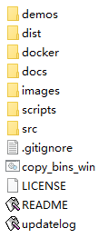
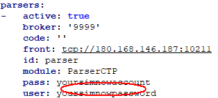
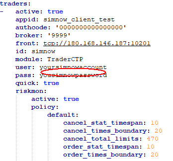
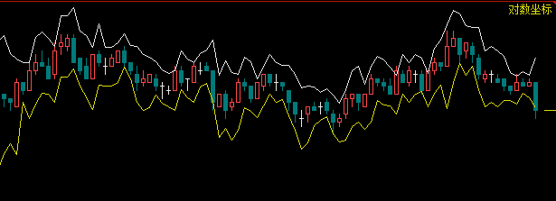

# WonderTrader 简明使用手册

***版本 Ver 0.9.1***


**关于WonderTrader开源量化交易框架：**

Wesley 开发者（知乎频道）

https://www.zhihu.com/people/yanguoye/posts																					

WonderTrader（官方github）

https://github.com/wondertrader

------

## 功能简介：

- WonderTrade 开源开发框架基于C++语言开发，支持*windows*和*linux*双平台系统

- 支持国内股票、期货等全品种交易市场

- 策略应用层提供基于C++语言的**wtcpp**和Python语言的**wtpy**的两套应用框架

- 提供四种交易引擎，以适应高频与跨周期多因子交易策略场景

- 多账户、多产品团队配置管理方案

- 图形化监控分析控制台

- 风险控制机制

- 高速tick级别回测模块		

  

# 配置安装：

### 一、wtpy应用框架

**【1】安装 Python（版本3.6以上，32位或64位，windows7或windows10操作系统）**

1. 下载地址：https://www.python.org/downloads/

2. 配置path环境变量

   ​	配置教程：https://jingyan.baidu.com/article/b7001fe1dd1ccc0e7282dd36.html

   

3. 安装完成后检查python是否安装成功

   检查方法如下：

   ```css
   1、打开cmd，输入python，点击回车
   2、输入import this，欣赏下python之禅
   3、输入pip list，检查安装了哪些第三方的安装包
   4、输入exit()，退出python
   ```

4. 配置pip国内镜像源

   ```css
   c:>\pip config set global.index-url https://pypi.tuna.tsinghua.edu.cn/simple
   ```

   其它镜像源：

   ​	https://mirrors.aliyun.com/pypi/simple/ 

5. 安装wtpy支持包

   ```css
   c:>\pip install wtpy --upgrade
   c:>\pip install itsdangerous==2.0.1
   ```

6. 以下命令查看wtpy的版本号

   ```css
   C:>\pip show wtpy
   ```

**【2】下载WonderTrader量化开发框架**

1. 下载wtpy应用框架

   ​        github地址：https://github.com/wondertrader/wtpy

   ​           gitee地址：https://gitee.com/wondertrader/wtpy

2. 解压安装目录

   ```css
   d:>\wondertrader\wtpy
   ```

   	

**【3】启动wtpy数据行情应用（上期期货仿真交易环境 ）**

1. 注册仿真账号

   **simnow**注册网址：*http://www.simnow.com.cn*

   ​	*第一次使用仿真账号需更改一次账号密码*

2. 配置数据行情机

   用文本编辑工具打开：***d:>\wondertrader\wtpy\demos\\datakit_fut\mdparsers.YAML***

   添加账号信息保存后退出（行情前置不检测账号信息，改用期货公司行情前置地址保证数据稳定）

   

3. 启动行情机

   执行文件所在目录：***demos\\datakit_fut***

   启动执行： **runDT**

**【4】启动wtpy策略交易应用**

1. 配置**CTA**引擎策略交易

   用文本编辑工具打开：***d:>\wondertrader\wtpy\demos\\cta_fut\tdtraders.YAML***

   添加账号信息保存后退出（交易地址是仿真前置地址，登录时需要验证账号信息）

   

2. 启动策略应用

   拷贝wtpy目录到cta_fut目录；

   执行文件所在目录：***demos\\cta_fut***

   启动执行：**run**
   

### 二、wtcpp应用框架

1. 下载wtcpp应用框架

   ​        github地址：https://github.com/wondertrader/wondertrader

   ​        gitee地址：https://gitee.com/wondertrader/wondertrader

2. 解压安装目录

   ```css
   d:>\wondertrader\wtcpp
   ```

   

3. 配置数据行情机

   用文本编辑工具打开配置文件：***d:>\wondertrader\wtcpp\dist\QuoteFactory\mdparsers.YAML***

   添加账号信息保存后退出（行情前置不检测账号信息，改用期货公司行情前置地址保证数据稳定）

   

4. 启动行情机

   执行文件所在目录：***dist\\QuoteFactory***

   启动执行： **QuoteFactory**

5. 配置CTA策略交易应用

   用文本编辑工具打开：***d:>\wondertrader\wtcpp\dist\\WtRunnerCta\\tdtraders.YAML***

   添加账号信息保存后退出（交易地址是仿真前置地址，登录时需要验证账号信息）

   

6. 启动策略应用

   执行文件所在目录：***dist\\WtRunnerCta***

   启动执行：**WtRunner**

### 三、WonderTrader配置参数说明

1. 
2. 

#### 使用注意事项：

```
1、行情机执行启动时间早于开盘时间2分钟
2、行情机关闭时间晚于16：00
3、启动行情机后再启动CTA引擎策略交易应用
4、编辑YAML文件只允许使用空格
5、自定义订阅品种注意品种名称格式
```

# 交易回测：

1. wtpy应用框架
2. wtcpp应用框架

# 策略实现：

### 一、CTA引擎

#### 【1】wtpy应用交易策略

1. DualThrust策略

   **策略描述：**

   ```css
   LL:=N日最低价
   HC:=N日最高收盘价
   LC:=N日最低收盘价
   触发值:=MAX(HH-LC,HC-LL)	
   上边值:=OPEN + 触发值 * 系数1
   下边值:=OPEN - 触发值 * 系数2
   
   当持仓为0的时候，价格突破上边界时，开多进场，价格突破下边界时，开空进场
   当持仓为多的时候，价格突破上边界时，保持仓位，价格突破下边界时，多仓出场
   当持仓为空的时候，价格突破上边界时，空仓出场，价格突破下边界时，保持仓位
   ```

   **策略图谱：**

   

   **策略实现：**

   - 参数说明

     ```css
     name        策略实例名称
     code        回测使用的合约代码
     barCnt      要拉取的K线条数
     period      要使用的K线周期，采用周期类型+周期倍数的形式，如m5表示5分钟线，d3表示3日线
     days        策略算法参数，算法引用的历史数据条数
     k1          策略算法参数，上边界系数
     k2          策略算法参数，下边界系数
     isForStk    DualThrust策略用于控制交易品种的代码
     ```

   - 策略源码

     ```python
     from wtpy import BaseStrategy
     from wtpy import Context
     
     class StraDualThrust(BaseStrategy):
     
         def __init__(self, name:str, code:str, barCnt:int, period:str, days:int, k1:float, k2:float, isForStk:bool = False):
             BaseStrategy.__init__(self, name)
     
             self.__days__ = days
             self.__k1__ = k1
             self.__k2__ = k2
     
             self.__period__ = period
             self.__bar_cnt__ = barCnt
             self.__code__ = code
     
             self.__is_stk__ = isForStk
     
         def on_init(self, context:Context):
             code = self.__code__    #品种代码
             if self.__is_stk__:
                 code = code + "Q"
     
             context.stra_get_bars(code, self.__period__, self.__bar_cnt__, isMain = True)
             context.stra_log_text("DualThrust inited")
     
         def on_calculate(self, context:Context):
             '''
             策略主调函数，所有的计算逻辑都在这里完成
             '''
             code = self.__code__    #品种代码
             
             # 交易单位，主要用于股票的适配
             trdUnit = 1
             if self.__is_stk__:
                 trdUnit = 100
     
             #读取最近50条1分钟线(dataframe对象)
             theCode = code
             if self.__is_stk__:
                 theCode = theCode + "Q"
             df_bars = context.stra_get_bars(theCode, self.__period__, self.__bar_cnt__, isMain = True)
     
             #把策略参数读进来，作为临时变量，方便引用
             days = self.__days__
             k1 = self.__k1__
             k2 = self.__k2__
     
             #平仓价序列、最高价序列、最低价序列
             closes = df_bars["close"]
             highs = df_bars["high"]
             lows = df_bars["low"]
     
             #读取days天之前到上一个交易日位置的数据
             hh = highs[-days:-1].max()
             hc = closes[-days:-1].max()
             ll = lows[-days:-1].min()
             lc = closes[-days:-1].min()
     
             #读取今天的开盘价、最高价和最低价
             lastBar = df_bars.iloc[-1]
             openpx = lastBar["open"]
             highpx = lastBar["high"]
             lowpx = lastBar["low"]
     
             '''
             !!!!!这里是重点
             1、首先根据最后一条K线的时间，计算当前的日期
             2、根据当前的日期，对日线进行切片,并截取所需条数
             3、最后在最终切片内计算所需数据
             '''
     
             #确定上轨和下轨
             upper_bound = openpx + k1* max(hh-lc,hc-ll)
             lower_bound = openpx - k2* max(hh-lc,hc-ll)
     
             #读取当前仓位
             curPos = context.stra_get_position(code)/trdUnit
     
             if curPos == 0:
                 if highpx >= upper_bound:
                     context.stra_enter_long(code, 1*trdUnit, 'enterlong')
                     context.stra_log_text("向上突破%.2f>=%.2f，多仓进场" % (highpx, upper_bound))
                     #修改并保存
                     self.xxx = 1
                     context.user_save_data('xxx', self.xxx)
                     return
     
                 if lowpx <= lower_bound and not self.__is_stk__:
                     context.stra_enter_short(code, 1*trdUnit, 'entershort')
                     context.stra_log_text("向下突破%.2f<=%.2f，空仓进场" % (lowpx, lower_bound))
                     return
             elif curPos > 0:
                 if lowpx <= lower_bound:
                     context.stra_exit_long(code, 1*trdUnit, 'exitlong')
                     context.stra_log_text("向下突破%.2f<=%.2f，多仓出场" % (lowpx, lower_bound))
                     #raise Exception("except on purpose")
                     return
             else:
                 if highpx >= upper_bound and not self.__is_stk__:
                     context.stra_exit_short(code, 1*trdUnit, 'exitshort')
                     context.stra_log_text("向上突破%.2f>=%.2f，空仓出场" % (highpx, upper_bound))
                     return
     
         def on_tick(self, context:Context, stdCode:str, newTick:dict):
             return
     ```

   - 策略调用入口 

     **run.py**

     ```python
     from wtpy import WtEngine,EngineType
     from Strategies.DualThrust import StraDualThrust   #从文件夹里引入策略类
     
     from ConsoleIdxWriter import ConsoleIdxWriter
     
     if __name__ == "__main__":
         #创建一个运行环境，并加入策略
         env = WtEngine(EngineType.ET_CTA)       #交易引擎类实例化
         env.init('../common/', "config.yaml")   #初始化配置信息方法
         
         #DualThrust策略实现
         straInfo = StraDualThrust(name='pydt_IF', code="SHFE.ag.2206", barCnt=50, period="m1", days=30, k1=0.2, k2=0.2, isForStk=False)
         env.add_cta_strategy(straInfo)   #添加CTA引擎的策略对象
     
         #输出
         idxWriter = ConsoleIdxWriter()
         env.set_writer(idxWriter)
         #执行
         env.run()
     
         kw = input('press any key to exit\n')
     ```

   

2. MACD策略

   ```python
   import pandas as pd
   
   from wtpy import BaseCtaStrategy
   from wtpy import CtaContext
   import numpy as np
   import math
   
   class MACDStra(BaseCtaStrategy):
       
       def __init__(self, name:str, code:str, barCnt:int,
                    period:str, margin_rate:float, money_pct:float, capital, k1:float,k2:float,days:int):
           BaseCtaStrategy.__init__(self, name)
   
           self.__period__ = period
           self.__bar_cnt__ = barCnt
           self.__code__ = code
           self.__margin_rate__ = margin_rate # 保证金比率
           self.__money_pct__ = money_pct # 每次使用的资金比率
           self.__capital__ = capital
           self.today_entry = 0  # 限制每天开仓次数的参数
           self.__k1__ = k1  # 短EMA的天数
           self.__k2__ = k2  # 长EMA的天数
           self.__days__ = days  #
   
       def on_init(self, context:CtaContext):
           code = self.__code__    # 品种代码
   
           context.stra_get_bars(code, 'd1', self.__bar_cnt__, isMain=False)
           context.stra_get_bars(code, self.__period__, self.__bar_cnt__, isMain = True)
           context.stra_log_text("MACDStra inited")
           pInfo = context.stra_get_comminfo(code)
           self.__volscale__ = pInfo.volscale
   
   
       def on_session_begin(self, context:CtaContext, curTDate:int):
           self.trade_next_day = 2
   
       def on_calculate(self, context:CtaContext):
           code = self.__code__    #品种代码
           # 把策略参数读进来，作为临时变量，方便引用
           curPrice = context.stra_get_price(code)
           margin_rate = self.__margin_rate__
           money_pct = self.__money_pct__
           volscale = self.__volscale__
           capital = self.__capital__
           days = self.__days__
           k1 = self.__k1__
           k2 = self.__k2__
           trdUnit_price = volscale * margin_rate * curPrice
           curPos = context.stra_get_position(code)
           if curPos == 0:
               self.cur_money = capital + context.stra_get_fund_data(0)
           df_bars = context.stra_get_bars(code, 'd1', self.__bar_cnt__, isMain=False)
           closes = df_bars.closes
           # 计算MACD
           df = pd.DataFrame(columns=['closes'],data=closes)
           df['EMA_short'] = df['closes'].ewm(span=k1,adjust=False).mean()
           df['EMA_long'] = df['closes'].ewm(span=k2,adjust=False).mean()
           df['DIF'] = df['EMA_short'] - df['EMA_long']
           df['DEA'] = df['DIF'].ewm(span=days, adjust=False).mean()
           df['MACD'] = (df['DIF']-df['DEA']) * 2
           # 获取昨日收盘价
           if df['MACD'].iloc[-1] > 0 and df['DIF'].iloc[-1] > 0 and curPos == 0:
               context.stra_enter_long(code, math.floor(self.cur_money * money_pct / trdUnit_price)
                                       , 'enterlong')
               self.cur_money = capital + context.stra_get_fund_data(0)
               context.stra_log_text('入场做多%s手' % (math.floor(self.cur_money * money_pct / trdUnit_price)))
           elif df['MACD'].iloc[-1] < 0 and df['DIF'].iloc[-1] < 0 and curPos == 0:
               context.stra_enter_short(code, math.floor(self.cur_money * money_pct / trdUnit_price)
                                        , 'entershort')
               self.cur_money = capital + context.stra_get_fund_data(0)
               context.stra_log_text('入场做空%s手' % (math.floor(self.cur_money * money_pct / trdUnit_price)))
           elif df['DIF'].iloc[-1] < 0 and curPos > 0:
               context.stra_set_position(code, 0, 'clear')
               context.stra_log_text('DIF < 0，平多')
           elif df['DIF'].iloc[-1] > 0 and curPos < 0:
               context.stra_set_position(code, 0, 'clear')
               context.stra_log_text('DIF > 0，平空')
           curTime = context.stra_get_time()
           cur_money = capital + context.stra_get_fund_data(code)
           if cur_money < self.cur_money * 0.99 and curPos != 0:
               self.trade_next_day = 0
           if curTime >= 1455 and curTime <= 1500:
               if self.trade_next_day == 0:
                   context.stra_set_position(code, 0, 'clear')
                   context.stra_log_text('亏损超过百分之一，下一交易日平仓')
   ```

#### 【2】wtcpp应用交易策略

1. DualThrust策略
2. MACD策略

### 二、HTF引擎

【1】wtpy应用交易策略

【2】wtcpp应用交易策略

